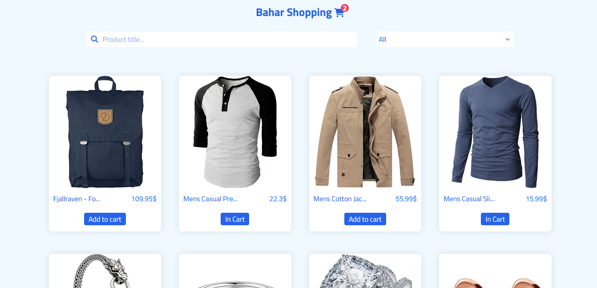

# Shopping

This is a store project where you can add products to the shopping cart, change their number, and remove them from the shopping cart. You can also search and sort products.
My goal of this project was to test my abilities in working with localStorage and axios and their combination

## [Review Online](<https://shoppingbahar.netlify.app//>)

---
## Contact Me

